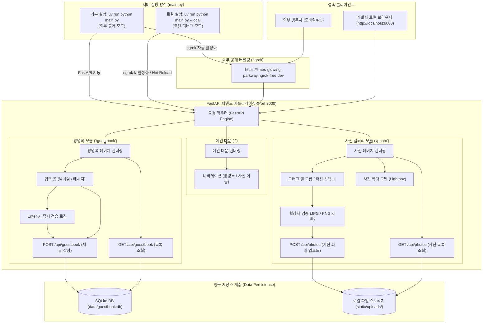

# ngrok 기반 공개 웹사이트 구축 계획서 (하이브리드 일체형)

본 문서는 **ngrok**을 활용하여 외부 사용자가 자유롭게 접속할 수 있는 공개 웹사이트를 구축하기 위한 상세 개발 계획서입니다.  
기본적으로 **`main.py` 실행 한 번으로 웹 서버와 ngrok 터널이 동시에 열리는 일체형 구조**를 기본으로 하되, 개발 편의성을 위해 **로컬 전용 디버깅 모드(`--local`)**를 함께 지원합니다.

초판 웹사이트는 **메인 홈페이지(`/`)**, **실시간 방명록 페이지(`/guestbook`)**, **사진 업로드/갤러리 페이지(`/photo`)** 총 3개의 핵심 페이지로 구성됩니다.

---

## 1. 시스템 기능 구조도 (시각화)

실행 모드(공개 모드 vs 로컬 디버그 모드) 분기 및 시스템 전반의 상호작용 흐름입니다.



---

## 2. 서버 실행 모드 상세

명령어 옵션을 통해 언제든지 필요에 따라 실행 모드를 전환할 수 있습니다.

| 실행 모드 | 실행 명령어 | 동작 특징 및 활용 |
|---|---|---|
| **🌐 외부 공개 모드 (기본값)** | `uv run python main.py` | - 로컬 서버와 ngrok 터널링 동시 실행<br>- `.env`의 `limes-glowing-parkway.ngrok-free.dev` 도메인 자동 연결<br>- 외부 지인 또는 모바일 기기 접속 테스트에 사용 |
| **💻 로컬 디버깅 모드** | `uv run python main.py --local` | - ngrok 없이 로컬(`http://127.0.0.1:8000`)에서만 기동<br>- 코드 변경 시 자동 재시작(`reload=True`) 지원<br>- 네트워크/외부 트래픽 제약 없이 가볍고 빠른 기능 개발 및 UI 디버깅 가능 |

---

## 3. 기술 스택 및 라이브러리

- **백엔드**: Python `FastAPI` + `Uvicorn`
  - 고성능 비동기 웹 프레임워크로, API 및 정적 HTML 페이지 서빙 지원
  - 기설치된 의존성(`fastapi`, `uvicorn`, `python-multipart`, `pyngrok`, `python-dotenv`) 활용 (추가 설치 불필요)
- **프론트엔드**: HTML5 + Vanilla JavaScript + Modern CSS (반응형 카드 뷰 디자인)
  - Fetch API를 활용하여 페이지 새로고침 없는 실시간 방명록 작성 및 사진 업로드 반영
- **데이터 저장소**:
  - **방명록**: Python 기본 내장 `sqlite3` 데이터베이스 (`data/guestbook.db`)
  - **사진 저장**: 서버 내 정적 디렉토리 (`static/uploads/`) - UUID 고유 파일명 적용
- **터널링 및 외부 공개**: `pyngrok` (`.env` 토큰 및 도메인 바인딩)

---

## 4. 세부 기능 및 페이지 구성

### 1) 메인 홈페이지 (`/`)
- 환영 메시지 및 웹사이트 소개 히어로 섹션
- **방명록 이동 버튼** (`/guestbook`) 및 **사진 업로드 이동 버튼** (`/photo`)
- 현재 실행 모드(공개/로컬) 안내 카드

### 2) 방명록 페이지 (`/guestbook`)
- **입력 폼**: 닉네임 및 메시지 입력 필드, '보내기' 버튼
- **엔터키(Enter) 즉시 전송**:
  - 메시지 입력 필드에서 `Enter` 입력 시 즉시 전송 (Shift+Enter는 줄바꿈 지원)
- **실시간 화면 표시**: 비동기 전송 후 페이지 새로고침 없이 상단 목록에 즉시 추가
- **서버 영구 보관**: SQLite DB에 안전하게 기록되어 서버 재시작 후에도 유지
- **홈으로 이동 버튼**: 메인 페이지(`/`) 복귀 버튼

### 3) 사진 업로드 페이지 (`/photo`)
- **파일 형식 제한 (JPG / PNG)**:
  - 프론트엔드: `accept=".jpg, .jpeg, .png, image/jpeg, image/png"`
  - 백엔드: Content-Type 및 파일 확장자 검증 (위반 시 400 에러 처리)
- **드래그 앤 드롭 및 파일 선택 UI**: 직관적인 업로드 존(Dropzone)
- **서버 저장 및 갤러리 즉시 반영**: `static/uploads/`에 저장 후 갤러리 그리드에 실시간 노출
- **사진 확대 모달(Lightbox)**: 갤러리 이미지 클릭 시 원본 비율 확대 보기
- **홈으로 이동 버튼**: 메인 페이지(`/`) 복귀 버튼

---

## 5. 프로젝트 디렉토리 구조 계획

```
c:/Projects/mini-project_0915/
├── .env                       # ngrok 토큰 및 고정 도메인 설정
├── pyproject.toml             # 프로젝트 설정 및 패키지 관리
├── PLAN.md                    # 본 개발 계획서
├── main.py                    # 서버 진입점, 라우팅, CLI 옵션(--local) 및 ngrok 제어
├── data/                      # 데이터 보관 디렉토리
│   └── guestbook.db           # 방명록 저장용 SQLite 데이터베이스
├── static/                    # 정적 파일 서빙 디렉토리
│   ├── css/
│   │   └── style.css          # 모던 & 미니멀 웹 스타일시트
│   ├── js/
│   │   ├── guestbook.js       # 방명록 비동기 통신 및 엔터키 전송 핸들러
│   │   └── photo.js           # 파일 검증, 비동기 업로드 및 갤러리 렌더러
│   └── uploads/               # 사용자가 업로드한 사진 저장 디렉토리
└── templates/                 # 각 페이지별 HTML 템플릿
    ├── index.html             # 메인 홈페이지
    ├── guestbook.html         # 방명록 페이지
    └── photo.html             # 사진 업로드 페이지
```

---

## 6. 작업 단계별 실행 계획

| 단계 | 작업 내용 | 상세 설명 |
|---|---|---|
| **1단계** | 디렉토리 구조 및 데이터베이스 스키마 준비 | `data/`, `static/uploads/`, `templates/` 생성 및 방명록 DB 테이블 초기화 |
| **2단계** | 백엔드 코어 및 REST API 개발 (`main.py`) | CLI 옵션(`--local`), 페이지 라우트, 방명록 API, 사진 업로드 API(JPG/PNG 검증) |
| **3단계** | 프론트엔드 UI 및 인터랙션 구현 | HTML 마크업, CSS 스타일링, `Enter` 키 전송 로직, 갤러리 뷰어 비동기 스크립트 |
| **4단계** | ngrok 터널링 통합 및 로컬/공개 스위칭 | `--local` 여부에 따른 ngrok 선택적 기동 로직 완성 |
| **5단계** | 종합 기능 검증 | 로컬 디버그 모드 테스트 및 ngrok 외부 접속 테스트 |
